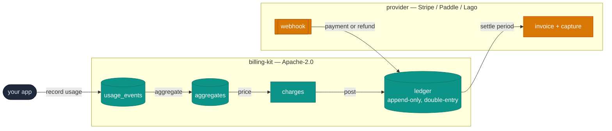
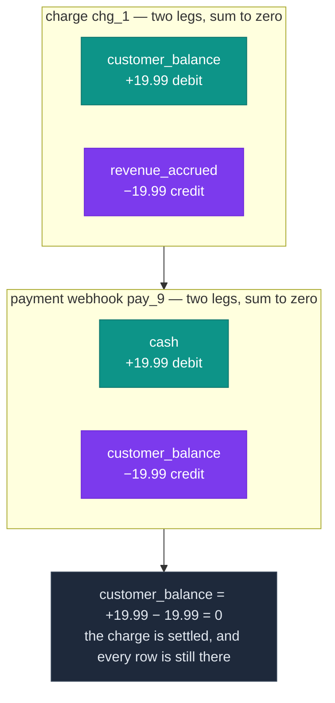

# billing-kit

Usage-based billing as a library, over a provider you choose.



billing-kit owns everything left of `settle` — the teal boxes. The provider owns
everything right of it. That line is the whole design, and it sits there because
it is the only place Stripe, Paddle and Lago agree on what an operation means.

Apache-2.0, so that both an AGPL open core and a commercial hosted service can
depend on it.

## Status

| Module | Entry point | State |
|---|---|---|
| Money types, shared vocabulary | `billing-kit` | ✅ implemented, tested |
| Usage ingest + idempotency | `billing-kit` | ✅ implemented, tested |
| Double-entry ledger | `billing-kit` | ✅ implemented, tested |
| Metering engine | `billing-kit/metering` | ✅ implemented, tested |
| Provider adapters — Stripe, Paddle | `billing-kit/providers` | ✅ implemented, tested |

Metering and providers are **separate entry points**, not re-exports from the
root, so an application using one does not compile the others. Import
`billing-kit/metering` for the batch driver and `billing-kit/providers` for the
adapter interface and its two implementations.

The ledger and money tests run against a real Postgres, and `pnpm run test:unit`
is green.

`pnpm test` is **not**, and that is deliberate. It also runs
`test/adversarial/`, four of whose probes fail because they name real defects
that are still open — read them before building anything that depends on a
replay being safe:

| | What is wrong today |
|---|---|
| **A2** | A replay carrying a *different* quantity is reported as a duplicate |
| **A4** | A ledger replay with different legs returns the old transaction; the corrected amount is silently discarded |
| **A5** | A late payment webhook cannot be posted — no partition, no default |
| **A8** | `allocate()` is documented as largest-remainder and is not |

A2 and A4 are the ones that matter for money: a correction that vanishes
without an error is a revenue discrepancy nobody can trace back. They stay red
until the semantics are settled, because a red test that names a defect is
worth more than a green suite that hides one. `prepublishOnly` gates on
`test:unit` so that choice does not double as a permanent publish block.

## What it does itself, and will not delegate

| | Why it cannot be delegated |
|---|---|
| Metering — accepting and deduplicating usage events | The event rate is your traffic's rate, not a provider's API budget. |
| Aggregation — events to billable quantities | Two of the three providers cannot do it, and the one that can is not always the one you ship with. |
| Pricing — quantities to amounts | You have to be able to answer "why is this number" from your own tables, offline, at any time. |
| The ledger — append-only, double-entry | It is the financial record. It has to survive changing providers. |
| Idempotency | Every provider's idempotency window is finite and shorter than your incident. |

The provider does customers, subscriptions, settlement of a closed period,
payment capture, refunds, and webhook signature verification. Nothing else.

billing-kit is not a tax engine, a dunning system, a pricing UI, an accounting
system, or a payment processor. It has interfaces where those attach and no
opinions inside them.

## Money

The rule, which the type system enforces rather than the documentation:

> Amounts are integer minor units in a `bigint`.
> Rates and quantities are exact decimals with a declared scale.
> **A rate is in minor units per unit** — cents, not dollars.
> Neither is ever a JavaScript `number`.

```ts
import { Money, Quantity, Rate, price } from 'billing-kit';

const q = Quantity.fromDecimalString('1234567');      // tokens
const r = Rate.fromDecimalString('0.00012');          // cents per token ($0.0000012)
const { amount, exactMinor, residueMinor } = price(q, r, 'USD');

amount.toDecimalString();  // "1.48"
exactMinor;                // "148.148040000000000000000000"  — minor units, unrounded
residueMinor;              // "0.148040000000000000000000"    — what rounding dropped
```

The rate is in minor units on purpose, and both layers read it that way: the
SQL metering charge is `round(quantity * rate)` with no major→minor scaling, and
`price()` matches it exactly. A rate in dollars would price 100× high in USD in
one layer and not the other — the same literal meaning two different amounts.

There is no constructor taking a `number`, no `fromFloat`, and no convenience
overload. Once a value has been through a double there is no way to tell an
exact 19.99 from a 19.99 that has already drifted, so the type refuses the
ambiguity instead of documenting it.

The argument against float is not magnitude. Doubles hold integers exactly up to
about ninety trillion dollars in cents. It is that **`SUM(double precision)` in
Postgres is not associative** — the planner may reorder a parallel aggregate, so
the same rows can produce different totals on different plans. A balance that
depends on the query plan cannot be re-derived, and re-derivability is the only
thing that makes an audit possible.

The currency exponent is never assumed. `* 100` is wrong for JPY (0), KWD (3)
and CLF (4), among others; billing-kit ships the ISO 4217 table and refuses a
currency not in it.

Rounding happens in exactly one place: `price`, half-to-even, with the
pre-rounding value kept. Not at the event, where the error grows with row count.
Not at the invoice, where the ledger and the invoice then disagree by the
residue with no row explaining the gap.

Wire format everywhere is `{ "amount": "1999", "currency": "USD" }` — a string,
in minor units. A decimal string would re-raise the question of how many places
the currency has, which the currency tag already answers.

## Ingest

```ts
import { createBilling, Quantity } from 'billing-kit';

const billing = createBilling({ db });   // once, at startup

const result = await billing.record({
  tenantId: 'acme',
  subjectId: 'user_123',
  source: 'api',
  externalId: req.id,          // yours, not ours: a value we generate cannot
  metric: 'tokens.input',      // deduplicate a retry, because the retry would
  quantity: Quantity.fromBigInt(1234n),   // generate a second one
  occurredAt: new Date(),
});

result.deduplicated;  // true on a replay. Answer 200, never 409.
```

`createBilling` binds the executor and the clock so neither is repeated per
call. It is a factory rather than a module-level singleton: two instances in one
process is the case that matters — a test suite with a rolled-back executor per
case, a worker spanning regions, a tenant on its own database — and a module
holding the connection serves exactly one of them. Configuration stays an
argument; nothing here reads `process.env`.

The free functions are still exported and still take `(db, …, now)`, for code
that holds a transaction or dispatches across shards per call:

```ts
import { record } from 'billing-kit';
await record(db, event, new Date());
```

Writes that must not disagree go in one transaction. The instance handed to the
callback is bound to it, so nothing inside can escape onto another connection:

```ts
await billing.transaction(async (tx) => {
  await tx.record(event);        // usage
  await tx.post(accrual);        // and the ledger entry for it
});                              // both, or neither
```

A duplicate is success. A retrying client treats 409 as fatal and either drops
the event or pages someone; the point of an idempotent endpoint is that the
retry is boring.

`occurredAt` is the caller's and is the partition key. `receivedAt` is the
database's. Both are kept, because the gap between them is how lateness is
measured, and lateness is what decides when a window can be sealed.

## Ledger

Double-entry, append-only. Positive is a debit, negative is a credit, and the
legs of a transaction sum to zero per currency.



Cash reaches the ledger only from a verified payment webhook — there is no
`credit(subject, amount)`. A charge accrues revenue and raises the customer's
balance; the payment clears it. Nothing is ever updated or deleted, so the whole
history is re-derivable at any time.

```ts
import { post, accrualPosting, balance } from 'billing-kit';

await post(db, accrualPosting({
  tenantId: 'acme',
  subjectId: 'user_123',
  chargeId: 'chg_1',
  amount: Money.fromDecimalString('19.99', 'USD'),
}), new Date());

await balance(db, {
  tenantId: 'acme', subjectId: 'user_123',
  account: 'customer_balance', currency: 'USD',
});
```

Three properties, each enforced rather than documented:

- **Append-only.** No update, no delete, no API for either, and a trigger on
  every partition that raises if someone tries it in psql.
- **Balanced.** Checked before the write, and again by a deferred constraint
  trigger at `COMMIT` — deferred because the legs go in one statement at a time
  and the transaction is unbalanced in between by construction.
- **Idempotent.** `(tenantId, sourceKind, sourceId)` is the natural key, so
  replaying a posting writes nothing the second time.

There is deliberately no `credit(subject, amount)`. Cash reaches the ledger from
a verified payment webhook and from nowhere else.

Settlement carries the estimate/authority split: under `quantity` settlement, or
with a merchant-of-record provider, the provider's number is authoritative and
ours was an estimate. The difference posts to `settlement_variance`, where a
non-zero balance is an alert. It is never absorbed into revenue.

## Database

```ts
export interface SqlExecutor {
  query<T>(text: string, params?: readonly unknown[]): Promise<T[]>;
  transaction<T>(fn: (tx: SqlExecutor) => Promise<T>): Promise<T>;
}
```

That is the whole database dependency. Prisma is the house tool for schema and
migrations, but the engine is raw SQL, so the runtime takes a narrow executor
and a bare `pg.Pool` satisfies it. `test/pg-executor.ts` is that adapter, and it
is about thirty lines including the transaction pinning.

Apply `sql/001_core.sql`, then create partitions ahead:

```sql
SELECT billing.ensure_core_partitions(3);
```

Everything lives in a `billing` schema so it cannot collide with a host
application's tables. Partitions are created ahead, never lazily on an insert
failure: a missing partition makes every insert into that range fail, which for
`usage_events` means billable usage on the floor.

Two things in that file exist because Prisma cannot express them, and `db push`
produces a plausible wrong answer for both — a partitioned parent's primary key
must include the partition key, and `PARTITION BY` has no Prisma equivalent at
all. Nothing fails and nothing warns; you find out at a hundred million rows.

## Design rules

1. No middleware is exported. Middleware is a framework's shape and there are
   two frameworks to serve. Functions in, plain data out.
2. No global singleton and no `process.env` read inside the library. A library
   that reads the environment cannot be instantiated twice in one process, which
   is what a test suite and a multi-region worker both need.
3. No Prisma at runtime.
4. Typed errors. `BillingError` carries a discriminated union; the message is
   generated from it and is never parsed.
5. No branch reads `provider.name`. Every branch reads `capabilities`. That rule
   is what keeps a fourth provider from being a rewrite, and it is checkable in
   review by grepping for the string.

## Development

```
pnpm install
pnpm typecheck
pnpm run test:unit         # the shipped suite — green
pnpm run test:adversarial  # the open defects — red, on purpose
pnpm build                 # dist/, ESM + CJS + declarations
pnpm run test:pack         # packs, installs the tarball, drives it with plain node
```

`test:pack` is the only check that says anything about what a consumer gets. It
runs `npm pack`, installs the tarball into a temporary directory sharing no
`node_modules` with this repo, and imports it from both ESM and CJS with no
loader — because an `exports` map is not code anyone runs, and the only way to
know it is right is to resolve against it from outside.

The money tests are pure and always run. The ingest and ledger tests need a
Postgres, and skip with a message when there is not one:

```
createdb billing_kit_test
pnpm test
```

Point them elsewhere with `BILLING_KIT_TEST_DATABASE_URL`. They run against a
real database rather than a mock because the behaviour worth testing — what
`ON CONFLICT DO UPDATE` does under a concurrent transaction, whether a deferred
trigger fires at the right moment, whether a partitioned table routes a row — is
in Postgres, not in the TypeScript. A mock would only confirm that we send the
SQL we decided to send.

## Licence

Apache-2.0. See `LICENSE` for the full text and `NOTICE` for attribution.

`PROVENANCE.md` records that this is a fresh implementation and what it was
informed by. Read it before importing anything into this repository.
