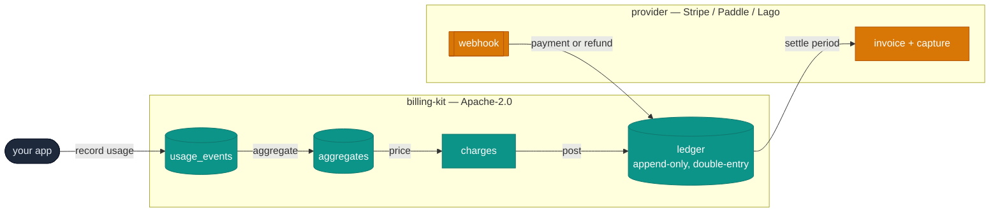
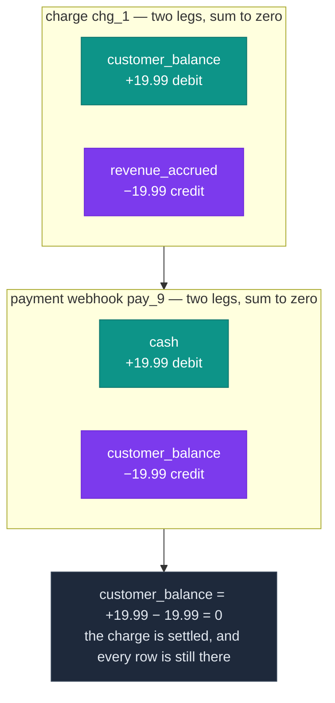

# billing-kit — diagrams

The mermaid sources for this repo. They live here rather than in the
README because npm renders no mermaid: on the package page a fence
like this one ships as raw DSL. GitHub and the QuxKit docs site both
draw them. The README carries an ASCII equivalent of each.

## The settle line — what billing-kit owns, and what the provider owns

## One charge and its payment: two transactions, each summing to zero

